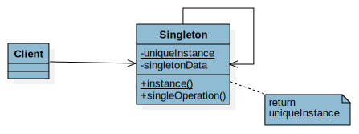
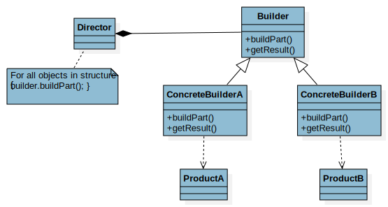
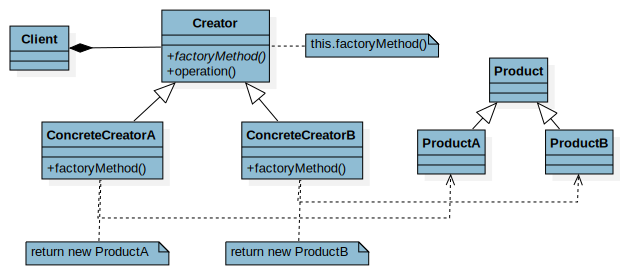
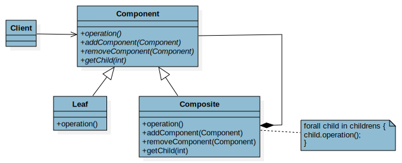
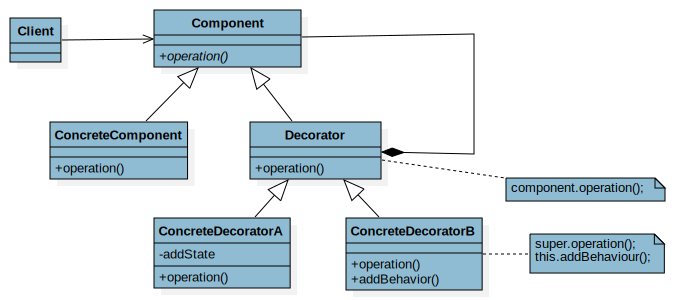
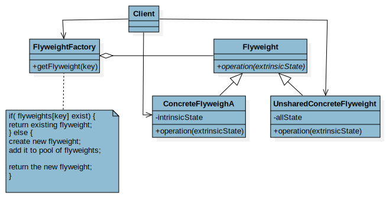

# Design Pattern

Design patterns are typical solutions to common problems
in software design. Each pattern is like a blueprint
that you can customize to solve a particular
design problem in your code.

## Table of Content

- [Creational Patterns](#creational-patterns)
    - [Singleton](#singleton)
    - [Builder](#builder)
    - [Factory Method](#factory-method)
    - [Abstract Factory](#abstract-factory)
- [Structural Patterns](#structural-patterns)
    - [Composite](#composite)
    - [Decorator](#decorator)
    - [Flyweight](#flyweight)
- [Behavioral Patterns](#behavioral-patterns)
    - [Command](#command)
    - [Memento](#memento)
    - [Observer](#observer)
    - [Visitor](#visitor)
    - [State](#state)

## Important

> To see all implementation. 
> 
> Please go to their respective **branches**.

## Creational Patterns

Provide object creation mechanisms that increase flexibility and reuse of existing code.

### Singleton

Please go to the branch `singleton` to see its implementation.

### Builder

Please go to the branch `supermarket` to see its implementation.

### Factory Method

Please go to the branch `method_factory` to see its implementation.

### Abstract Factory

Please go to the branch `supermarket` to see its implementation

## Structural Patterns

Take care of effective communication and the assignment of responsibilities between objects.

### Composite

Please go to the branch `composite` to see its implementation.

### Decorator

Please go to the branch `decorator` to see its implementation.

### Flyweight

Please go to the branch `flyweight` to see its implementation.

## Behavioral Patterns

Explain how to assemble objects and classes into larger structures, while keeping these structures flexible and efficient.

### Command

Please go to the branch `vendingmachine` to see its implementation.

### Memento

Please go to the branch `memento` to see its implementation.

### Observer

Please go to the branch `observer` to see its implementation.

### Visitor

Please go to the branch `visitor` to see its implementation.

### State

Please go to the branch `vendingmachine` to see its implementation.

